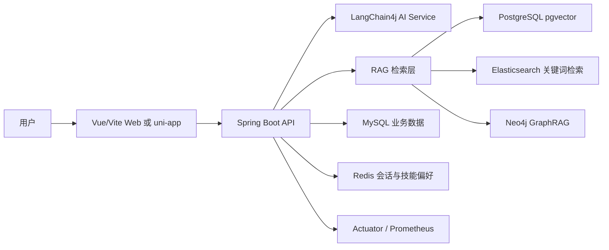

<h1 align="center">知心饮食与健康助手</h1>

<p align="center">
  <strong>面向饮食咨询、健康状态记录与多会话 AI 问答的 Spring Boot + Vue 全栈项目</strong>
</p>

<p align="center">
  
  
  
  
  
</p>

## 项目概览

本仓库包含一个饮食与健康咨询系统：后端使用 Spring Boot 提供用户、会话、技能偏好、聊天和知识图谱同步接口；前端包含 `diet_helper-frontend` 的 Vue/Vite Web 应用，以及 `consultant-uniapp` 的 uni-app 客户端。后端通过 LangChain4j 接入 DashScope 兼容 OpenAI 接口，并结合 pgvector、Elasticsearch、Neo4j、Redis 和 MySQL 支撑知识检索、会话记忆和业务数据。

## 核心能力

- 用户注册、登录、资料维护、BMI 和日常饮水/睡眠/运动状态记录
- 多会话聊天，支持按用户和会话维度恢复消息历史
- Redis 存储聊天记忆、会话元信息、会话排序和技能偏好
- 基于 pgvector、Elasticsearch 关键词召回、rerank 精排与可选 Neo4j GraphRAG 的知识增强检索
- 通过 Markdown 技能文件生成可选的饮食偏好/目标提示
- 文本输入 Guardrail，覆盖敏感词与提示注入类表达
- 餐食图片识别接口，面向图片中的食物和营养分析场景
- Actuator、Micrometer、Prometheus 与 Grafana 观测配置

## 技术栈

| 模块 | 技术 |
| --- | --- |
| 后端 | Java 17, Spring Boot 3.5.0, Maven |
| AI/RAG | LangChain4j, DashScope 兼容 OpenAI 接口, pgvector, Elasticsearch, Neo4j |
| 数据访问 | MyBatis Plus, MySQL, PostgreSQL, Redis, Redisson |
| 观测 | Spring Boot Actuator, Micrometer, Prometheus, Grafana |
| Web 前端 | Vue 3, Vite, 原生 fetch |
| uni-app 前端 | Vue 3, Pinia, @dcloudio/uni-app, Vite |

## 项目结构

```text
consultant/
├─ src/main/java/com/zyt/consultant/
│  ├─ aiservice/          # LangChain4j AI Service
│  ├─ config/             # Spring、模型、pgvector、Redis 配置
│  ├─ controller/         # HTTP API 控制器
│  ├─ GraphRAG/           # Neo4j 知识图谱同步与关系召回
│  ├─ guardrail/          # 输入安全拦截
│  ├─ mapper/             # MyBatis Mapper
│  ├─ metrics/            # 业务指标
│  ├─ rag/                # 混合检索、关键词召回、rerank 与来源追踪
│  ├─ repository/         # Redis 聊天记忆存储
│  ├─ service/            # 用户、会话、技能和视觉分析服务
│  └─ tools/              # LLM 工具调用
├─ src/main/resources/
│  ├─ content/            # 食品知识库 JSON 内容
│  ├─ skills/             # 技能 Markdown 定义
│  ├─ static/             # 后端静态资源
│  ├─ application.yml     # 默认应用配置
│  └─ System.txt          # 系统提示词
├─ diet_helper-frontend/  # Vue/Vite Web 前端
├─ consultant-uniapp/     # uni-app 客户端
├─ observability/         # Prometheus 与 Grafana 配置
├─ pom.xml
└─ LICENSE
```

## 架构关系



## 本地运行

### 环境要求

- JDK 17+
- Maven 3.x
- Node.js `^20.19.0 || >=22.12.0`（`diet_helper-frontend/package.json` 中声明）
- MySQL、Redis、PostgreSQL 与 pgvector
- Elasticsearch（当 `app.rag.search.enabled` 开启时使用）
- Neo4j（当 `app.knowledge-graph.neo4j.enabled` 开启时使用）

### 后端配置

默认配置位于 `src/main/resources/application.yml`，包含本地开发所需的模型、数据源、Redis、pgvector、Elasticsearch、Neo4j、Guardrail 和监控配置结构。生产或共享环境中应通过环境变量、私有配置或部署平台密钥注入真实凭据。

模型相关配置使用 `API_KEY` 环境变量：

```bash
API_KEY=your_dashscope_api_key
```

后端默认端口为 `8087`。Web 前端的 Vite 代理会把 `/chat` 与 `/user` 请求转发到 `http://localhost:8087`；uni-app 客户端可通过 `VITE_API_BASE_URL` 覆盖接口基地址。

### 启动后端

```bash
mvn spring-boot:run
```

### 启动 Web 前端

```bash
cd diet_helper-frontend
npm install
npm run dev
```

### 启动 uni-app 客户端

```bash
cd consultant-uniapp
npm install
npm run dev:h5
```

也可以使用 `npm run dev:mp-weixin` 运行微信小程序开发构建。

### 测试

```bash
mvn test
```

## API 概览

| Method | Path | Source | 说明 |
| --- | --- | --- | --- |
| GET | `/chat` | `ChatController.java` | 文本聊天，参数为 `memoryId`、`message`、可选 `skillIds` |
| POST | `/chat/image` | `ChatController.java` | 餐食图片分析，接收 `multipart/form-data` |
| GET | `/chat/sessions` | `ChatSessionController.java` | 查询用户会话列表 |
| GET | `/chat/sessions/messages` | `ChatSessionController.java` | 查询单个会话消息 |
| POST | `/chat/sessions/create` | `ChatSessionController.java` | 创建会话 |
| POST | `/chat/sessions/delete` | `ChatSessionController.java` | 删除会话 |
| POST | `/user/register` | `UserController.java` | 注册用户 |
| POST | `/user/login` | `UserController.java` | 用户登录 |
| GET | `/user/profile` | `UserController.java` | 查询用户资料 |
| POST | `/user/profile/update` | `UserController.java` | 更新用户资料 |
| GET | `/user/daily` | `UserController.java` | 查询日常健康状态 |
| POST | `/user/daily/update` | `UserController.java` | 更新日常健康状态 |
| GET | `/skills/list` | `SkillController.java` | 查询技能目录 |
| GET | `/skills/user` | `SkillController.java` | 查询用户已选技能 |
| POST | `/skills/user/apply` | `SkillController.java` | 保存用户技能偏好 |
| POST | `/skills/user/apply-by-memory` | `SkillController.java` | 通过 `memoryId` 保存技能偏好 |
| POST | `/knowledge-graph/sync` | `KnowledgeGraphController.java` | 同步知识图谱 |
| POST | `/knowledge-graph/sync-foods` | `KnowledgeGraphController.java` | 同步食品知识图谱 |

## RAG 与会话记忆

后端 RAG 层由传统内容检索和 GraphRAG 补充检索组成。传统检索侧使用 pgvector 语义召回，并可启用 Elasticsearch 关键词检索与 DashScope `qwen3-rerank` 精排；GraphRAG 侧在 Neo4j 开启时补充食品、营养、特征和分类关系。最终命中的来源会通过 `ReferenceSourceContext` 汇总，并由聊天接口追加到回答末尾。

会话记忆和会话列表存储在 Redis 中，核心 key 结构为：

| 用途 | Redis 类型 | Key |
| --- | --- | --- |
| 聊天记忆 | String | `chat:memory:user:{userId}:session:{sessionId}` |
| 会话元信息 | Hash | `chat:sessions:user:{userId}:meta` |
| 会话排序 | ZSet | `chat:sessions:user:{userId}:order` |
| 技能偏好 | Set | `consultant:user:skills:{userId}` |

## 前端说明

`diet_helper-frontend` 是面向浏览器的 Vue/Vite 应用，核心视图由登录面板、会话侧栏、聊天区、个人资料区、资料弹窗和日常状态弹窗组成。登录后的用户可以创建/删除会话、查看历史消息、更新资料和日常状态，并选择饮食技能偏好。

`consultant-uniapp` 提供咨询、会话、我的和登录页面，API 调用集中在 `src/api/`，请求封装位于 `src/utils/request.js`。

## 监控

项目开启了 Actuator 与 Prometheus 指标暴露，常用端点包括：

```text
/actuator/health
/actuator/metrics
/actuator/prometheus
```

`observability/docker-compose.yml` 提供 Prometheus 与 Grafana 的本地观测环境配置。

## 安全与隐私

项目会处理用户手机号、健康资料、饮食描述、日常状态、聊天内容和餐食图片。开发、演示和截图时应优先使用脱敏数据；生产环境中的模型 Key、数据库密码、Redis 密码、图数据库密码和监控系统凭据应通过环境变量或私有配置注入，不建议提交到仓库。

默认配置文件保留了本地开发结构，私有配置和生产配置不应写入 README。启用第三方模型、追踪或观测系统前，需要确认数据留存、访问控制和审计要求。

## License

本项目使用 Apache License 2.0 开源许可，详见 [LICENSE](./LICENSE)。
